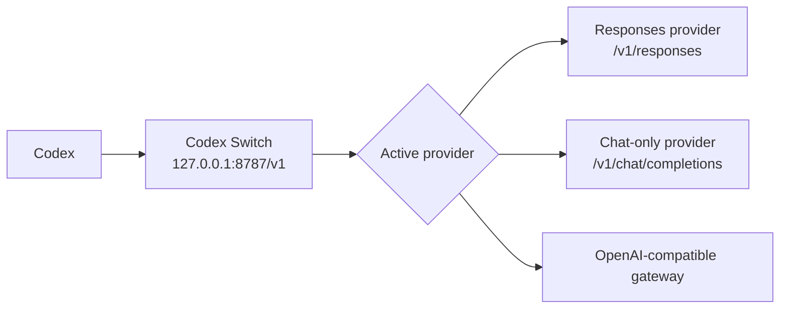

# ⚡ Codex Switch

> A local provider switcher for Codex. Keep Codex pointed at one stable local URL, then switch upstream API providers from a small desktop app without restarting Codex.

[中文文档](./README_ZH.md) · [Releases](https://github.com/chenziwenhaoshuai/Codex-switch/releases) · [License](./LICENSE)

---

## ✨ What Is It?

Codex Switch is a local OpenAI-compatible router for Codex.

```text
Codex -> http://127.0.0.1:8787/v1 -> active provider
```

Codex keeps using the same local `base_url`. Codex Switch decides which upstream provider receives each request.

This means you can switch between providers, model names, API keys, and chat-only gateways while Codex is still running.

---

## 💡 Why It Exists

Codex is happiest when its API configuration stays stable. Real usage is not always that tidy:

- 🔁 you may switch between multiple third-party gateways
- 🧪 you may test temporary API keys or trial endpoints
- 🧭 different providers may require different model names
- 🔌 some providers expose Chat Completions but not Responses
- 🛠️ tool calls need compatibility glue across provider formats

Codex Switch keeps the Codex side simple and moves provider switching into a local app.

---

## 🚀 Highlights

| Feature | Description |
| --- | --- |
| 🖥️ macOS app | Native SwiftUI app with bundled local Python proxy. |
| 🪟 Windows app | Electron app with local Node.js proxy and Windows packaging. |
| 🔁 Hot switching | Click `Use` to switch the active upstream provider without restarting Codex. |
| 🎯 Per-provider default model | Store the real model name each provider expects. |
| 🧭 Model mapping | Optionally map every incoming Codex model to the provider default model. |
| 🔄 Chat-to-Responses bridge | Convert Codex `/v1/responses` requests to `/v1/chat/completions` for chat-only providers. |
| 🛠️ Tool-call compatibility | Handles custom tools, `apply_patch`, `tool_search`, namespaced tools, and streaming tool calls. |
| 🧩 Codex config helper | Updates only `[model_providers.custom].base_url`; your provider remains `custom`. |
| 📜 Optional logs | Request/response captures are toggleable and can be cleared from Settings. |
| ⚡ Faster forwarding | Avoids unnecessary log parsing when logs are disabled and keeps upstream connections warm where supported. |
| 🔒 Local-first | Provider config stays on your machine; secrets and logs are ignored by Git. |

---

## 🧭 How It Works



For providers that support the Responses API, Codex Switch forwards requests directly.

For providers that only support Chat Completions, enable **Chat-to-Responses bridge** in that provider's configuration. Codex Switch will translate the request and response shape locally.

---

## ⚡ Quick Start

1. Download the latest build from [GitHub Releases](https://github.com/chenziwenhaoshuai/Codex-switch/releases).
2. Start Codex Switch.
3. Add a provider with a safe name, `Base URL`, API key, and default model.
4. Click `Use` on the provider you want active.
5. Point Codex to:

```text
http://127.0.0.1:8787/v1
```

Codex can keep using the same local URL while you switch upstream providers in the app.

---

## ⚙️ Configure Codex

You can set Codex manually:

```sh
export OPENAI_BASE_URL="http://127.0.0.1:8787/v1"
codex
```

Or use the macOS Settings button:

```text
Set Codex custom base_url
```

That helper only updates `base_url` under `[model_providers.custom]` in `~/.codex/config.toml`.

It does **not** rename your provider. It keeps Codex using `custom`.

Example:

```toml
model_provider = "custom"

[model_providers.custom]
name = "custom"
wire_api = "responses"
requires_openai_auth = true
base_url = "http://127.0.0.1:8787/v1"
```

Use any safe model name in your Codex config. If model mapping is enabled for the active provider, Codex Switch will rewrite it before forwarding.

---

## 🧩 Provider Settings

Each provider can have its own routing behavior.

| Setting | What it does |
| --- | --- |
| `Name` | Display name in the provider list. |
| `Base URL` | Upstream OpenAI-compatible endpoint, for example `https://api.example.com/v1`. |
| `API Key` | Forwarded as `Authorization: Bearer <API Key>`. |
| `Default Model` | The model name this provider should receive. |
| `Map all requests to default model` | When enabled, every incoming request model is rewritten to `Default Model`. |
| `Chat-to-Responses bridge` | Converts Codex Responses requests to Chat Completions for chat-only providers. |

Safe example:

```json
{
  "name": "Example Provider",
  "baseURL": "https://api.example.com/v1",
  "apiKey": "<YOUR_API_KEY>",
  "defaultModel": "provider-model-name",
  "modelMapping": {
    "enabled": true,
    "targetModel": "provider-model-name"
  },
  "chatCompletionsBridgeEnabled": false
}
```

---

## 🎯 Model Mapping

Model mapping solves this common problem:

```text
Codex config model: openai/some-model
Provider expects:    provider-real-model
```

When mapping is enabled for the active provider:

```text
incoming request model -> provider default model
```

So Codex can keep a stable local config while each provider receives the exact model name it supports.

---

## 🔄 Chat-to-Responses Bridge

Codex talks to `/v1/responses`.

Some upstream providers only expose `/v1/chat/completions`. For those providers, enable:

```text
Chat-to-Responses bridge
```

Codex Switch will locally convert:

- request input/messages
- tools and tool choices
- custom tools
- `apply_patch`
- `tool_search`
- streamed chat deltas
- final response objects

Direct Responses mode is still preferred when your provider supports it, because it is a shorter and faster path. Use the bridge only for chat-only providers.

---

## 🛠️ Tool-Call Compatibility

Codex relies heavily on tool calls. Codex Switch includes compatibility handling for both direct Responses forwarding and Chat bridge mode:

- 🧰 custom tool calls
- 🩹 `apply_patch`
- 🔎 `tool_search`
- 🧱 namespaced tools
- 🌊 streaming tool-call deltas
- 🔁 Chat Completions tool calls converted back into Responses items

This is especially useful for third-party OpenAI-compatible providers that support text generation well but differ in tool-call details.

---

## 📜 Logs & Privacy

Persistent request/response logs are optional.

- ✅ Logs can be enabled or disabled in Settings.
- 🧹 Log cache can be cleared from Settings.
- 🔐 API keys are not written into the repository.
- ⚠️ Logs may contain request/response content and provider URLs, so do not share them publicly.

Local data paths:

| Platform | Data |
| --- | --- |
| macOS | `~/Library/Application Support/Codex Switch/providers.json` |
| macOS logs | `~/Library/Application Support/Codex Switch/logs` |
| Windows | `%APPDATA%/Codex Switch` |

This repository intentionally ignores local secrets, logs, DMGs, EXEs, and build outputs.

---

## 📦 Install

Download from [GitHub Releases](https://github.com/chenziwenhaoshuai/Codex-switch/releases).

Current release assets include:

- 🍎 `Codex.Switch.1.0.2.dmg` for macOS
- 🪟 `Codex.Switch.Setup.1.0.2.exe` for Windows installer
- 🧳 `Codex.Switch.1.0.2.exe` for Windows portable usage

On macOS, drag `Codex Switch.app` into `/Applications`.

> Current macOS local builds use ad-hoc signing. If macOS blocks opening it, right-click the app and choose **Open**.

---

## 🛠️ Build From Source

### 🍎 macOS

Requirements:

- macOS 13+
- Swift toolchain / Xcode command line tools
- [`create-dmg`](https://github.com/create-dmg/create-dmg)

```sh
brew install create-dmg
./scripts/build-dmg.sh
```

Output:

```text
CodexSwitchApp/build/Codex Switch.app
CodexSwitchApp/Codex.Switch.1.0.2.dmg
```

### 🪟 Windows

Requirements:

- Node.js
- npm

```powershell
cd CodexSwitchWin
npm install
npm run build
```

Output:

```text
CodexSwitchWin\dist
```

The repository also includes a GitHub Actions workflow for building Windows EXE artifacts manually.

---

## 🗂️ Project Structure

```text
CodexSwitchApp/
  CodexSwitchApp/
    ContentView.swift            # macOS UI
    ProviderStore.swift          # provider config persistence
    ProxyProcessManager.swift    # launches bundled Python proxy
    Resources/proxy.py           # macOS local router

CodexSwitchWin/
  src/
    main.js                      # Electron main process
    providerStore.js             # Windows provider config persistence
    proxy.js                     # Windows local router
    renderer/                    # Electron UI

scripts/
  build-dmg.sh                   # macOS app and DMG build script

providers.example.json           # safe example config
logo.png                         # app logo source
```

---

## 🧪 Development Checks

Useful local checks:

```sh
swiftc -typecheck \
  CodexSwitchApp/CodexSwitchApp/AppDelegate.swift \
  CodexSwitchApp/CodexSwitchApp/CodexSwitchApp.swift \
  CodexSwitchApp/CodexSwitchApp/CodexConfigManager.swift \
  CodexSwitchApp/CodexSwitchApp/ContentView.swift \
  CodexSwitchApp/CodexSwitchApp/ProviderStore.swift \
  CodexSwitchApp/CodexSwitchApp/ProxyProcessManager.swift \
  CodexSwitchApp/CodexSwitchApp/ProxyViewModel.swift

python3 -m py_compile CodexSwitchApp/CodexSwitchApp/Resources/proxy.py

cd CodexSwitchWin
npm run build
```

---

## 🔒 Safety Notes

Before publishing or sharing changes, check that these are not committed:

- real API keys
- private provider URLs
- local `providers.json`
- request/response logs
- local `.env`
- app build outputs

Use placeholders in documentation and screenshots.

---

## 📄 License

MIT License. Copyright © 2026 Ziwen.
