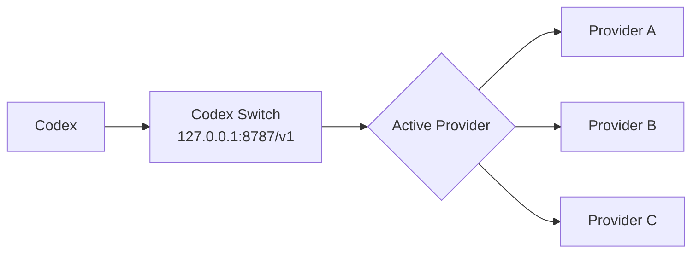

# ⚡ Codex Switch

> A native macOS provider switcher for Codex. Keep Codex connected to one local URL, then switch upstream API providers from a tiny desktop app.

[中文文档](./README_ZH.md) · [Releases](https://github.com/chenziwenhaoshuai/Codex-switch/releases) · [License](./LICENSE)

---

## ✨ What Is Codex Switch?

Codex Switch is a local OpenAI-compatible router for Codex.

Instead of changing Codex config every time you want to try another API provider, you point Codex to one local endpoint:

```text
Codex -> http://127.0.0.1:8787/v1 -> active provider
```

Then you use the macOS app to choose which provider should receive the request.

---

## 💡 Why This Exists

Codex works best when its API base URL stays stable.

But in daily work, it is common to switch between:

- official APIs
- OpenAI-compatible gateways
- local or private routing endpoints
- temporary keys
- different model names across providers

Restarting Codex for every provider change breaks flow. Codex Switch keeps Codex pointed at a stable local URL and moves provider switching into a small, local macOS app.

---

## 🚀 Features

| Feature | Description |
| --- | --- |
| 🖥️ Native macOS UI | Built with SwiftUI. |
| 🔁 Hot provider switching | Switch upstream providers without restarting Codex. |
| 🔐 Per-provider API key | Each provider has its own local API key. |
| 🎯 Default model | Set a default model for each provider. |
| 🧭 Per-provider model mapping | Rewrite incoming `model` values per provider. |
| 🧩 Codex config helper | One-click update for Codex `custom` provider `base_url`. |
| 📜 Local logs | Inspect local routing activity for debugging. |
| 📦 DMG build script | Reproducible local macOS packaging. |

---

## 🧭 How It Works



Codex only sees the local router. Codex Switch reads the currently active provider from local config and forwards each request upstream.

---

## 📸 App Workflow

1. Add one or more providers.
2. Fill in the provider `Base URL` and `API Key`.
3. Optionally set `Default Model` and model mapping.
4. Click `Use` to make a provider active.
5. Keep Codex pointed at `http://127.0.0.1:8787/v1`.

---

## ⚙️ Configure Codex

You can set Codex manually:

```sh
export OPENAI_BASE_URL="http://127.0.0.1:8787/v1"
codex
```

Or open Codex Switch Settings and click:

```text
Set Codex custom base_url
```

That only updates `base_url` under `[model_providers.custom]` in `~/.codex/config.toml`.

It does **not** rename your provider and does **not** replace the rest of your Codex config.

Example:

```toml
model_provider = "custom"

[model_providers.custom]
name = "custom"
wire_api = "responses"
requires_openai_auth = true
base_url = "http://127.0.0.1:8787/v1"
```

---

## 🧩 Provider Configuration

Runtime provider config is stored locally:

```text
~/Library/Application Support/Codex Switch/providers.json
```

Example:

```json
{
  "activeProviderId": "openai",
  "providers": [
    {
      "id": "openai",
      "name": "OpenAI",
      "baseURL": "https://api.openai.com/v1",
      "apiKey": "",
      "enabled": true,
      "headers": {},
      "defaultModel": "",
      "modelMapping": {
        "enabled": false,
        "targetModel": ""
      }
    }
  ]
}
```

### 🎯 Model Mapping

When `modelMapping.enabled` is `true`, Codex Switch rewrites the request body's top-level `model` field:

```text
incoming model -> provider model
```

If `targetModel` is empty, Codex Switch falls back to the provider's `defaultModel`.

---

## 🔐 Privacy & Safety

Codex Switch is local-first.

This repository intentionally does **not** include:

- real API keys
- private provider URLs
- local `providers.json`
- request/response logs
- DMG files
- build output

Provider API keys are stored locally on your machine and forwarded as:

```text
Authorization: Bearer <API Key>
```

The `.gitignore` is configured to keep secrets, logs, and build artifacts out of Git.

---

## 📦 Install

Download the latest DMG from:

[GitHub Releases](https://github.com/chenziwenhaoshuai/Codex-switch/releases)

Then drag `Codex Switch.app` into `/Applications`.

> The current local build uses ad-hoc signing. If macOS blocks opening it, right-click the app and choose **Open**.

---

## 🛠️ Build From Source

Requirements:

- macOS 13+
- Swift toolchain
- [`create-dmg`](https://github.com/create-dmg/create-dmg)

Install `create-dmg`:

```sh
brew install create-dmg
```

Build:

```sh
./scripts/build-dmg.sh
```

Output:

```text
ByteRouterApp/build/Codex Switch.app
ByteRouterApp/Codex Switch.dmg
```

---

## 🗂️ Project Structure

```text
ByteRouterApp/
  ByteRouterApp/
    ContentView.swift            # macOS UI
    ProviderStore.swift          # provider config persistence
    ProxyProcessManager.swift    # launches bundled Python router
    Resources/proxy.py           # local HTTP router
scripts/build-dmg.sh             # local app and DMG build script
providers.example.json           # safe example config
```

---

## 🧪 Development Notes

Useful checks:

```sh
swiftc -typecheck \
  ByteRouterApp/ByteRouterApp/AppDelegate.swift \
  ByteRouterApp/ByteRouterApp/ByteRouterApp.swift \
  ByteRouterApp/ByteRouterApp/CodexConfigManager.swift \
  ByteRouterApp/ByteRouterApp/ContentView.swift \
  ByteRouterApp/ByteRouterApp/ProviderStore.swift \
  ByteRouterApp/ByteRouterApp/ProxyProcessManager.swift \
  ByteRouterApp/ByteRouterApp/ProxyViewModel.swift

python3 -m py_compile ByteRouterApp/ByteRouterApp/Resources/proxy.py
```

---

## 📄 License

MIT License. Copyright © 2026 Ziwen.
