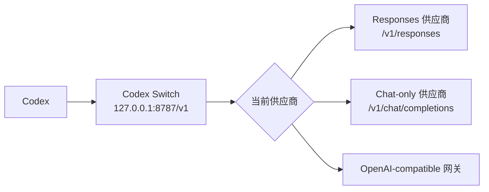

# ⚡ Codex Switch

> 面向 Codex 的本地 API 供应商切换器。让 Codex 始终连接一个稳定的本地地址，然后在桌面应用里切换真正的上游供应商，无需重启 Codex。

[English](./README.md) · [Releases](https://github.com/chenziwenhaoshuai/Codex-switch/releases) · [License](./LICENSE)

---

## ✨ 它是什么？

Codex Switch 是一个本地 OpenAI-compatible 路由器。

```text
Codex -> http://127.0.0.1:8787/v1 -> 当前选中的供应商
```

Codex 只需要固定使用本地 `base_url`。Codex Switch 会根据你在应用里选中的 provider，把请求转发给真正的上游供应商。

这意味着：切换供应商、模型名、API Key，甚至接入只支持 Chat Completions 的网关时，都不需要重启 Codex。

---

## 💡 为什么需要它？

Codex 更适合使用稳定的 API 配置，但真实工作流往往没这么规整：

- 🔁 你可能经常切换多个第三方网关
- 🧪 你可能需要测试临时 API Key 或试用端点
- 🧭 不同供应商要求的模型名可能完全不同
- 🔌 有些供应商只有 Chat Completions，没有 Responses
- 🛠️ 工具调用在不同供应商之间需要兼容处理

Codex Switch 的目标是让 Codex 侧保持简单，把供应商切换、模型映射和格式转换交给本地应用处理。

---

## 🚀 功能亮点

| 功能 | 说明 |
| --- | --- |
| 🖥️ macOS 应用 | SwiftUI 原生界面，内置本地 Python 代理。 |
| 🪟 Windows 应用 | Electron 界面，本地 Node.js 代理，可打包 EXE。 |
| 🔁 热切换供应商 | 点击 `Use` 即可切换当前上游，不需要重启 Codex。 |
| 🎯 每个供应商独立默认模型 | 为每个 provider 保存它真正支持的模型名。 |
| 🧭 模型统一映射 | 可选：把 Codex 发来的任意模型名统一映射为 provider 的默认模型。 |
| 🔄 Chat 转 Responses | 将 Codex 的 `/v1/responses` 请求转换到 `/v1/chat/completions`。 |
| 🛠️ 工具调用兼容 | 处理 custom tools、`apply_patch`、`tool_search`、命名空间工具和流式工具调用。 |
| 🧩 Codex 配置助手 | 只更新 `[model_providers.custom].base_url`，provider 仍然保持 `custom`。 |
| 📜 可选日志 | 请求/响应捕获可开关，也可以在设置里清理缓存。 |
| ⚡ 更快的中转 | 日志关闭时避免额外解析；支持的端会复用上游连接。 |
| 🔒 本地优先 | 供应商配置保存在本机，密钥和日志不会进入 Git。 |

---

## 🧭 工作原理



如果供应商支持 Responses API，Codex Switch 会直接转发请求。

如果供应商只支持 Chat Completions，可以在该供应商配置里开启 **Chat-to-Responses bridge**。Codex Switch 会在本地完成请求和响应格式转换。

---

## ⚡ 快速开始

1. 从 [GitHub Releases](https://github.com/chenziwenhaoshuai/Codex-switch/releases) 下载最新版本。
2. 启动 Codex Switch。
3. 添加供应商，填写名称、`Base URL`、API Key 和默认模型。
4. 在想使用的供应商上点击 `Use`。
5. 让 Codex 指向：

```text
http://127.0.0.1:8787/v1
```

之后 Codex 可以一直保持同一个本地地址，你只需要在应用里切换上游供应商。

---

## ⚙️ 配置 Codex

你可以手动设置：

```sh
export OPENAI_BASE_URL="http://127.0.0.1:8787/v1"
codex
```

也可以使用 macOS 设置里的按钮：

```text
Set Codex custom base_url
```

这个助手只会更新 `~/.codex/config.toml` 中 `[model_providers.custom]` 的 `base_url`。

它不会把 provider 改成别的名字。Codex 仍然使用 `custom`。

示例：

```toml
model_provider = "custom"

[model_providers.custom]
name = "custom"
wire_api = "responses"
requires_openai_auth = true
base_url = "http://127.0.0.1:8787/v1"
```

Codex 配置里的模型名可以保持稳定。如果当前 provider 开启了模型映射，Codex Switch 会在转发前把模型名改写成该供应商配置的默认模型。

---

## 🧩 供应商配置

每个 provider 都可以有自己的转发策略。

| 配置项 | 作用 |
| --- | --- |
| `Name` | 供应商在列表中的显示名称。 |
| `Base URL` | 上游 OpenAI-compatible 地址，例如 `https://api.example.com/v1`。 |
| `API Key` | 以 `Authorization: Bearer <API Key>` 的形式转发。 |
| `Default Model` | 这个供应商实际接收的模型名。 |
| `Map all requests to default model` | 开启后，所有请求里的模型都会被改写为 `Default Model`。 |
| `Chat-to-Responses bridge` | 为只支持 Chat Completions 的供应商开启格式转换。 |

安全示例：

```json
{
  "name": "Example Provider",
  "baseURL": "https://api.example.com/v1",
  "apiKey": "<YOUR_API_KEY>",
  "defaultModel": "provider-model-name",
  "modelMapping": {
    "enabled": true,
    "targetModel": "provider-model-name"
  },
  "chatCompletionsBridgeEnabled": false
}
```

---

## 🎯 模型映射

模型映射用于解决这类问题：

```text
Codex 配置里的模型: openai/some-model
供应商真实模型名:  provider-real-model
```

当当前供应商开启模型映射后：

```text
请求中的模型 -> 供应商默认模型
```

这样 Codex 可以保持固定配置，而每个供应商都会收到自己支持的模型名。

---

## 🔄 Chat 转 Responses

Codex 使用 `/v1/responses`。

有些上游供应商只提供 `/v1/chat/completions`。对这类供应商，开启：

```text
Chat-to-Responses bridge
```

Codex Switch 会在本地转换：

- 请求 input/messages
- tools 和 tool choices
- custom tools
- `apply_patch`
- `tool_search`
- 流式 chat delta
- 最终 Responses 结构

如果供应商原生支持 Responses，优先使用直接转发，因为链路更短、速度更快。Chat bridge 更适合只提供 Chat Completions 的供应商。

---

## 🛠️ 工具调用兼容

Codex 高度依赖工具调用。Codex Switch 在直接 Responses 转发和 Chat bridge 两条路径里都做了兼容处理：

- 🧰 custom tool calls
- 🩹 `apply_patch`
- 🔎 `tool_search`
- 🧱 命名空间工具
- 🌊 流式工具调用 delta
- 🔁 Chat Completions tool calls 转回 Responses items

这对于第三方 OpenAI-compatible 供应商尤其有用：它们通常文本生成没问题，但工具调用细节可能和 Codex 预期不完全一致。

---

## 📜 日志与隐私

持久化请求/响应日志是可选的。

- ✅ 可以在 Settings 里开启或关闭日志。
- 🧹 可以在 Settings 里清理日志缓存。
- 🔐 API Key 不会写入仓库。
- ⚠️ 日志可能包含请求/响应内容和供应商 URL，不建议公开分享。

本地数据路径：

| 平台 | 数据 |
| --- | --- |
| macOS | `~/Library/Application Support/Codex Switch/providers.json` |
| macOS 日志 | `~/Library/Application Support/Codex Switch/logs` |
| Windows | `%APPDATA%/Codex Switch` |

仓库已忽略本地密钥、日志、DMG、EXE 和构建产物。

---

## 📦 安装

从 [GitHub Releases](https://github.com/chenziwenhaoshuai/Codex-switch/releases) 下载。

当前 release 产物包括：

- 🍎 `Codex.Switch.1.0.2.dmg`：macOS 版本
- 🪟 `Codex.Switch.Setup.1.0.2.exe`：Windows 安装版
- 🧳 `Codex.Switch.1.0.2.exe`：Windows 便携版

macOS 上把 `Codex Switch.app` 拖入 `/Applications` 即可。

> 当前 macOS 本地构建使用 ad-hoc 签名。如果 macOS 拦截启动，可以右键应用并选择 **打开**。

---

## 🛠️ 从源码构建

### 🍎 macOS

要求：

- macOS 13+
- Swift 工具链 / Xcode Command Line Tools
- [`create-dmg`](https://github.com/create-dmg/create-dmg)

```sh
brew install create-dmg
./scripts/build-dmg.sh
```

输出：

```text
CodexSwitchApp/build/Codex Switch.app
CodexSwitchApp/Codex.Switch.1.0.2.dmg
```

### 🪟 Windows

要求：

- Node.js
- npm

```powershell
cd CodexSwitchWin
npm install
npm run build
```

输出：

```text
CodexSwitchWin\dist
```

仓库中也提供了 GitHub Actions workflow，可以手动触发 Windows EXE 构建。

---

## 🗂️ 项目结构

```text
CodexSwitchApp/
  CodexSwitchApp/
    ContentView.swift            # macOS 界面
    ProviderStore.swift          # 供应商配置持久化
    ProxyProcessManager.swift    # 启动内置 Python 代理
    Resources/proxy.py           # macOS 本地路由器

CodexSwitchWin/
  src/
    main.js                      # Electron 主进程
    providerStore.js             # Windows 供应商配置持久化
    proxy.js                     # Windows 本地路由器
    renderer/                    # Electron 界面

scripts/
  build-dmg.sh                   # macOS App 和 DMG 构建脚本

providers.example.json           # 安全示例配置
logo.png                         # 应用 logo 源图
```

---

## 🧪 开发检查

常用本地检查命令：

```sh
swiftc -typecheck \
  CodexSwitchApp/CodexSwitchApp/AppDelegate.swift \
  CodexSwitchApp/CodexSwitchApp/CodexSwitchApp.swift \
  CodexSwitchApp/CodexSwitchApp/CodexConfigManager.swift \
  CodexSwitchApp/CodexSwitchApp/ContentView.swift \
  CodexSwitchApp/CodexSwitchApp/ProviderStore.swift \
  CodexSwitchApp/CodexSwitchApp/ProxyProcessManager.swift \
  CodexSwitchApp/CodexSwitchApp/ProxyViewModel.swift

python3 -m py_compile CodexSwitchApp/CodexSwitchApp/Resources/proxy.py

cd CodexSwitchWin
npm run build
```

---

## 📄 许可证

MIT License。Copyright © 2026 Ziwen.
