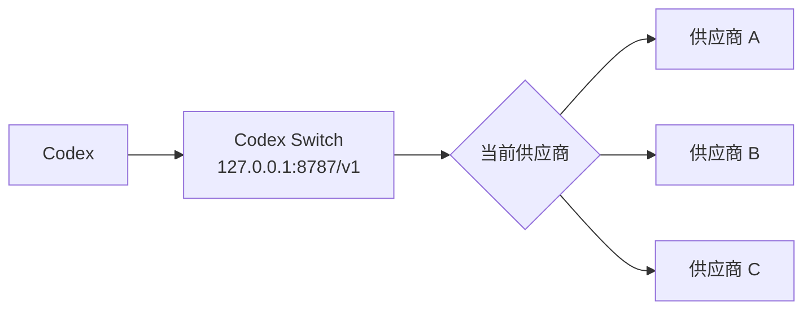

# ⚡ Codex Switch

> 一个面向 Codex 的 macOS 原生 API 供应商切换器。让 Codex 始终访问稳定的本地地址，然后在桌面应用里切换真正的上游供应商。

[English](./README.md) · [Releases](https://github.com/chenziwenhaoshuai/Codex-switch/releases) · [License](./LICENSE)

---

## ✨ Codex Switch 是什么？

Codex Switch 是一个本地 OpenAI-compatible 路由器。

你不需要每次切换 API 供应商都修改 Codex 配置，只需要让 Codex 始终访问这个本地地址：

```text
Codex -> http://127.0.0.1:8787/v1 -> 当前选中的供应商
```

然后在 macOS 应用里选择真正接收请求的上游供应商。

---

## 💡 为什么需要它？

Codex 更适合使用稳定的 API Base URL。

但真实工作流里，我们经常需要切换：

- 官方 API
- OpenAI-compatible 网关
- 本地或私有路由端点
- 临时 API Key
- 不同供应商的不同模型名

每次切换上游都重启 Codex 会打断工作流。Codex Switch 的目标是让 Codex 始终连接一个稳定的本地地址，把供应商切换交给本地 macOS 应用。

---

## 🚀 功能亮点

| 功能 | 说明 |
| --- | --- |
| 🖥️ 原生 macOS UI | 使用 SwiftUI 构建。 |
| 🔁 热切换供应商 | 不重启 Codex 即可切换上游 API。 |
| 🔐 每个供应商独立 API Key | 每个 provider 都有自己的本地 API Key。 |
| 🎯 默认模型 | 每个 provider 可以设置默认访问模型。 |
| 🧭 按供应商模型映射 | 不同 provider 可使用不同模型映射策略。 |
| 🧩 Codex 配置助手 | 一键更新 Codex `custom` provider 的 `base_url`。 |
| 📜 本地日志 | 方便调试路由请求和响应。 |
| 📦 DMG 构建脚本 | 可复现地生成 macOS 安装包。 |

---

## 🧭 工作原理



Codex 只知道本地路由器。Codex Switch 每次请求都会读取当前选中的供应商，并把请求转发到对应上游。

---

## 📸 使用流程

1. 添加一个或多个供应商。
2. 填写供应商 `Base URL` 和 `API Key`。
3. 可选：配置 `Default Model` 和模型映射。
4. 点击 `Use` 设为当前供应商。
5. 让 Codex 始终访问 `http://127.0.0.1:8787/v1`。

---

## ⚙️ 配置 Codex

你可以手动设置：

```sh
export OPENAI_BASE_URL="http://127.0.0.1:8787/v1"
codex
```

也可以打开 Codex Switch 的 Settings，点击：

```text
Set Codex custom base_url
```

这个按钮只会更新 `~/.codex/config.toml` 中 `[model_providers.custom]` 的 `base_url`。

它不会重命名你的 provider，也不会覆盖其他 Codex 配置。

示例：

```toml
model_provider = "custom"

[model_providers.custom]
name = "custom"
wire_api = "responses"
requires_openai_auth = true
base_url = "http://127.0.0.1:8787/v1"
```

---

## 🧩 供应商配置

运行时供应商配置保存在本机：

```text
~/Library/Application Support/Codex Switch/providers.json
```

示例：

```json
{
  "activeProviderId": "openai",
  "providers": [
    {
      "id": "openai",
      "name": "OpenAI",
      "baseURL": "https://api.openai.com/v1",
      "apiKey": "",
      "enabled": true,
      "headers": {},
      "defaultModel": "",
      "modelMapping": {
        "enabled": false,
        "targetModel": ""
      }
    }
  ]
}
```

### 🎯 模型映射

当 `modelMapping.enabled` 为 `true` 时，Codex Switch 会改写请求体顶层的 `model` 字段：

```text
请求模型 -> 供应商模型
```

如果 `targetModel` 为空，则回退到该供应商的 `defaultModel`。

---

## 🔐 隐私与安全

Codex Switch 是本地优先的工具。

这个仓库不会包含：

- 真实 API Key
- 私有供应商地址
- 本地 `providers.json`
- 请求/响应日志
- DMG 安装包
- 构建产物

供应商 API Key 只保存在你的本机，并以如下方式转发给上游：

```text
Authorization: Bearer <API Key>
```

`.gitignore` 已经配置好，避免把密钥、日志和构建产物提交到 Git。

---

## 📦 安装

从 GitHub Releases 下载最新 DMG：

[GitHub Releases](https://github.com/chenziwenhaoshuai/Codex-switch/releases)

然后把 `Codex Switch.app` 拖入 `/Applications`。

> 当前本地构建使用 ad-hoc 签名。如果 macOS 阻止打开，可以右键应用并选择 **打开**。

---

## 🛠️ 从源码构建

要求：

- macOS 13+
- Swift 工具链
- [`create-dmg`](https://github.com/create-dmg/create-dmg)

安装 `create-dmg`：

```sh
brew install create-dmg
```

构建：

```sh
./scripts/build-dmg.sh
```

输出：

```text
CodexSwitchApp/build/Codex Switch.app
CodexSwitchApp/Codex Switch.dmg
```

---

## 🗂️ 项目结构

```text
CodexSwitchApp/
  CodexSwitchApp/
    ContentView.swift            # macOS 界面
    ProviderStore.swift          # 供应商配置持久化
    ProxyProcessManager.swift    # 启动内置 Python 路由器
    Resources/proxy.py           # 本地 HTTP 路由器
scripts/build-dmg.sh             # 本地 App 和 DMG 构建脚本
providers.example.json           # 安全示例配置
```

---

## 🧪 开发检查

常用检查命令：

```sh
swiftc -typecheck \
  CodexSwitchApp/CodexSwitchApp/AppDelegate.swift \
  CodexSwitchApp/CodexSwitchApp/CodexSwitchApp.swift \
  CodexSwitchApp/CodexSwitchApp/CodexConfigManager.swift \
  CodexSwitchApp/CodexSwitchApp/ContentView.swift \
  CodexSwitchApp/CodexSwitchApp/ProviderStore.swift \
  CodexSwitchApp/CodexSwitchApp/ProxyProcessManager.swift \
  CodexSwitchApp/CodexSwitchApp/ProxyViewModel.swift

python3 -m py_compile CodexSwitchApp/CodexSwitchApp/Resources/proxy.py
```

---

## 📄 许可证

MIT License。Copyright © 2026 Ziwen.
